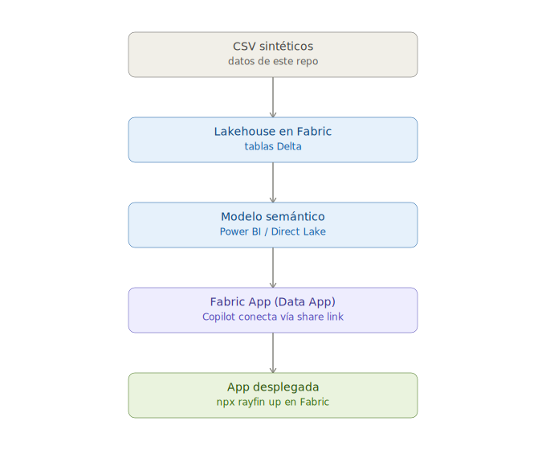

<div align="center">

# 🌮 Laboratorio Fabric Apps + GitHub Copilot
### "México Lindo" — dashboard de ventas construido con lenguaje natural


</div>

Ejercicio hands-on para construir, con lenguaje natural (GitHub Copilot), una
aplicación en **Microsoft Fabric Apps** que se conecta a un **modelo semántico**
publicado en Fabric. Temática: cadena ficticia de restaurantes **México Lindo**.

> ⚠️ **Nota de vigencia:** Fabric Apps y Rayfin están en **preview pública**
> (anunciados en Microsoft Build, junio 2026). Comandos, límites y comportamiento
> pueden cambiar antes de la disponibilidad general (GA). Esta guía está validada
> contra Microsoft Learn (páginas `fabric/apps/*`, actualizadas el 2 de junio de
> 2026) al 10 de julio de 2026. Se recomienda revisar los enlaces de
> la sección [Fuentes oficiales](#-fuentes-oficiales) por si hubo cambios.

## 📋 Tabla de contenidos

- [Objetivo del ejercicio](#-objetivo-del-ejercicio)
- [Requisitos previos](#-requisitos-previos)
- [Flujo del ejercicio](#-flujo-del-ejercicio)
- [Agenda y checkpoints](#-agenda-y-checkpoints-2-horas)
- [Paso a paso detallado](#-paso-a-paso-detallado)
- [Solución de problemas comunes](#-solución-de-problemas-comunes)
- [Parte 2 — Foundry IQ](#-parte-2--agentic-development-con-foundry-iq)
- [Fuentes oficiales](#-fuentes-oficiales)
- [Estructura de este repo](#-estructura-de-este-repo)

---

## 🎯 Objetivo del ejercicio

Que el participante, siguiendo este repo en vivo durante el evento, construya de
principio a fin:

1. Un dataset cargado en un Lakehouse de Fabric.
2. Un modelo semántico sobre ese dataset.
3. Una Fabric App (plantilla **Data App**) que un agente de código
   (GitHub Copilot) conecta al modelo semántico usando lenguaje natural,
   generando visuales (KPIs, gráficas, tabla) sin escribir DAX ni código de
   autenticación a mano.
4. El despliegue de esa app en el propio tenant de Fabric de tu organización.

**Propósito de la app:** analítico y de monitoreo — un dashboard de solo
lectura sobre el modelo semántico (KPIs, tendencias, ranking de platillos).
**No es una app transaccional**: no captura pedidos ni escribe datos de vuelta
a Fabric. Si más adelante se quiere explorar writeback, es una fase aparte,
no parte de este ejercicio.

> **⏱ Duración objetivo del taller práctico: 2 horas.** Ver [Agenda y checkpoints](#-agenda-y-checkpoints-2-horas).

---

## ✅ Requisitos previos

Ver el detalle completo, verificable, en [`docs/PRERREQUISITOS.md`](./docs/PRERREQUISITOS.md).
Resumen rápido:

- Tenant de Fabric con el workload **Fabric Apps (preview)** habilitado por un
  administrador.
- Setting de administrador **"Semantic Model Execute Queries REST API"**
  habilitado (Fabric Admin Portal → Integration settings).
- Workspace con **capacidad Fabric** asignada, en una **región donde Fabric App
  esté disponible** (ver tabla de regiones abajo). Mexico Central y Spain
  Central **no** son válidas para este ejercicio.
- Permisos de **Contributor o Admin** en el workspace.
- Licencia de **Power BI Pro** (para crear y publicar el modelo semántico).
- Node.js + npm instalados localmente.
- **Azure CLI** instalado (`az login` funcionando).
- VS Code con la extensión de GitHub Copilot, o el CLI `copilot` instalado
  (terminal).
- Licencia de GitHub Copilot activa.

<details>
<summary><strong>🌍 Ver regiones válidas para este laboratorio</strong></summary>

Fabric Apps (preview) **no** está disponible en todas las regiones. Regiones
verificadas como disponibles (fuente: Microsoft Learn, región availability,
actualizado 19 de junio de 2026):

| Región | Fabric App disponible |
|---|---|
| US - North Central US | ✅ |
| US - West US | ✅ |
| US - West US 2 | ✅ |
| US - Central US | ✅ |
| Francia Central | ✅ |
| **México Central** | ❌ No disponible |
| **España Central** | ❌ No disponible |

👉 Para el evento, el workspace de práctica debe crearse con una capacidad
asignada en una de las regiones marcadas ✅ (recomendado: **North Central US**
o **West US 2** por latencia razonable desde LATAM). Esto es solo para el
ejercicio con datos sintéticos; no aplica para arquitecturas productivas de
clientes reales, donde la región debe decidirse por residencia de datos y
gobierno, no solo por disponibilidad de la feature.

</details>

---

## 🗺️ Flujo del ejercicio

<div align="center">



</div>

---

## 🕐 Agenda y checkpoints (2 horas)

| Bloque | Tiempo | Qué se valida al cerrar el bloque |
|---|---|---|
| 1. Verificación de prerrequisitos | 0:00–0:15 | Login a Fabric OK, workload Fabric Apps habilitado, workspace en región correcta |
| 2. Carga del dataset al Lakehouse | 0:15–0:35 | Las 4 tablas (`categorias`, `sucursales`, `platillos`, `ventas`) visibles como Delta Tables |
| 3. Creación del modelo semántico | 0:35–0:55 | Modelo publicado, relaciones entre tablas creadas, una medida DAX básica probada (ej. `Total Ventas`) |
| 4. Obtener el nombre del modelo semántico | 0:55–1:05 | Nombre del modelo semántico copiado, confirmado único en el workspace |
| 5. Scaffold del Fabric App (plantilla `dataapp`) | 1:05–1:20 | Proyecto local creado, `npm run dev` corre sin errores |
| 6. Prompt a Copilot para conectar el modelo y generar visuales | 1:20–1:45 | La app muestra al menos 1 KPI, 1 gráfica y 1 tabla con datos reales del modelo |
| 7. Ajustes de estilo/branding vía Copilot | 1:45–1:55 | Marca "México Lindo" aplicada de forma consistente |
| 8. Despliegue (`npx rayfin up`) y validación en el portal | 1:55–2:00 | App visible y funcional dentro del portal de Fabric |

> 📌 **Nota de facilitación:** si algún participante se atrasa, los bloques
> 1–4 (dataset → modelo semántico) se pueden dar **pre-armados** solo para
> ese caso puntual, empezando desde el bloque 5. Esta es una decisión de
> facilitación, no técnica.

---

## 📖 Paso a paso detallado

> 🤖 **¿Prefieres que GitHub Copilot te guíe?** Abre la **carpeta de este repo**
> en VS Code, abre **Copilot Chat en modo Agent** y escribe *"vamos a hacer el
> laboratorio, guíame paso a paso"*. Copilot leerá
> [`.github/copilot-instructions.md`](./.github/copilot-instructions.md) y te
> conducirá un paso a la vez, explicando cada acción. (Requiere los
> prerrequisitos de Copilot — ver [`docs/PRERREQUISITOS.md`](./docs/PRERREQUISITOS.md) §4.1.)

### Bloque 1 — Verificación de prerrequisitos (0:00–0:15)

Sigue el checklist de [`docs/PRERREQUISITOS.md`](./docs/PRERREQUISITOS.md) punto por
punto. No continúes al bloque 2 si algo falla aquí — son los puntos que más
tiempo hacen perder en vivo.

### Bloque 2 — Cargar el dataset al Lakehouse (0:15–0:35)

1. En el workspace, crea un ítem **Lakehouse** (ej. `lh_mexicolindo`).
2. Sube los 4 archivos de `/data` a **Files** del Lakehouse (arrastrar y
   soltar desde el portal, o "Get data" → "Upload files").
3. Usa **"Load to Tables"** sobre cada CSV (clic derecho → *Load to Tables* →
   *New table*) para convertirlos en tablas Delta:
   - `categorias`
   - `sucursales`
   - `platillos`
   - `ventas`
4. Verifica en el **SQL Analytics Endpoint** del Lakehouse que las 4 tablas
   existen y tienen filas (`SELECT COUNT(*) FROM ventas` debe regresar ~10,000).

> ℹ️ **Nota de validación:** esta parte usa capacidades estándar de Fabric
> (Lakehouse, Load to Tables), no específicas de Rayfin — conocimiento
> general de la plataforma, no requiere validación adicional contra Rayfin.

### Bloque 3 — Crear el modelo semántico (0:35–0:55)

1. Desde el Lakehouse, selecciona **"New semantic model"**.
2. Nómbralo `sm_mexicolindo`.
3. Incluye las 4 tablas.
4. En el editor del modelo, crea las relaciones:
   - `sucursales[id_sucursal]` → `ventas[id_sucursal]`
   - `platillos[id_platillo]` → `ventas[id_platillo]`
   - `categorias[id_categoria]` → `platillos[id_categoria]`

   Cardinalidad y dirección de filtro para cada una:

   | Relación | Cardinalidad | Lado "1" | Lado "varios" | Dirección de filtro |
   |---|---|---|---|---|
   | `sucursales` ↔ `ventas` | 1:* | `sucursales` (5 filas únicas) | `ventas` (~10,000 filas) | única (de `sucursales` a `ventas`) |
   | `platillos` ↔ `ventas` | 1:* | `platillos` (18 filas únicas) | `ventas` | única (de `platillos` a `ventas`) |
   | `categorias` ↔ `platillos` | 1:* | `categorias` (5 filas únicas) | `platillos` (18 filas) | única (de `categorias` a `platillos`) |

   Con dirección única en las tres basta para todos los visuales del
   ejercicio (KPI, barras por sucursal, línea mensual, tabla de platillos).
   No se necesita bidireccional en ninguna.
5. Crea una medida base para probar el modelo:
   ```dax
   Total Ventas = SUM(ventas[monto_total])
   ```
6. Guarda y publica el modelo.

### Bloque 4 — Obtener el nombre del modelo (0:55–1:05)

1. Abre el modelo semántico publicado en el **Power BI Service**.
2. Copia el nombre exacto del modelo semántico — lo vas a pegar en el
   prompt a Copilot en el Bloque 6. Confirma que sea único dentro del
   workspace, para que Copilot no lo confunda con otro modelo de nombre
   parecido.

### Bloque 5 — Scaffold del Fabric App con la plantilla `dataapp` (1:05–1:20)

Esta parte sí es específica de Rayfin — validada contra Microsoft Learn
(`fabric/apps/create-app`, `fabric/apps/data-apps-template`) y confirmada
contra la UI real de Fabric.

1. En el workspace, **New item → App**. Nómbralo `app-mexicolindo`.
2. En la pantalla **"Pick a template to get started"**, elige la tarjeta
   **"Data App"** (no "Blank App" ni "To-Do App").
3. Deja que termine de desplegar el recurso. Fabric abre el panel
   **"Getting Started"** con un comando **ya armado con el nombre real de tu
   workspace** — cópialo directo de ahí (botón de copiar al lado del
   comando) en vez de escribirlo a mano, para no arriesgar un typo. Lo vamos
   a necesitar en el siguiente paso.
4. Abre una ventana de terminal (recomendado VS Code) y haz **sign in** en
   tu tenant/suscripción de Entra ID (el mismo tenant donde está tu Fabric)
   con `az login` de Azure CLI. **Por qué:** esto asegura que Copilot opere
   sobre el tenant/suscripción correcto desde el inicio, evitando que
   busque recursos en un tenant equivocado (el mismo tipo de confusión que
   documentamos en la tabla de troubleshooting). Si no tienes Azure CLI,
   instálalo con `winget install --exact --id Microsoft.AzureCLI`.
5. Selecciona y confirma tu suscripción desde la terminal, y pega el
   comando que te generó el panel de Fabric App (similar a este):
   ```bash
   npm create @microsoft/rayfin@latest -- "app-mexicolindo" --template dataapp --workspace "<tu-workspace>"
   ```
6. Te va a pedir permisos para instalar archivos y dependencias npm de
   Rayfin — autorízalo.
7. Una vez completo el scaffold inicial, navega al directorio del proyecto
   y levanta el servidor de desarrollo:
   ```bash
   cd app-mexicolindo
   npm run dev
   ```
   `npm run dev` debería darte una URL local, pero **actualmente la
   plantilla "Data App" no se puede visualizar fuera de Fabric** — al abrir
   esa URL verás el mensaje `Can't open this app outside Fabric`. Esto es
   una limitación conocida de Fabric, no un error tuyo. Usa `Ctrl+C` en la
   terminal para salir del proceso cuando quieras.

> 🔀 **Ruta Alterna/Opcional — agente de código:** el mismo panel del App en Fabric tiene un botón
> **"Copy prompt"** ("Using an AI coding agent? Skip the steps below") que
> entrega un prompt equivalente a los pasos 5–7 de arriba (scaffold, cd al
> proyecto, `npm run dev`) — pensado para un agente con permiso de ejecutar
> comandos de terminal (ej. Copilot en modo agente en VS Code, no solo
> chat). El paso 4 (`az login`) sigue siendo necesario antes, sin importar
> qué ruta uses. Si usas esta ruta, ten presente que le das a un agente
> permiso de correr comandos por su cuenta — vale la pena revisar cada uno
> antes de aprobarlo, como con cualquier agente de código.

### Bloque 6 — Prompt a Copilot para conectar el modelo semántico (1:20–1:45)

1. Abre otra ventana de VS Code desde la carpeta del proyecto y abre el
   panel de **GitHub Copilot Chat** (`Ctrl+Shift+I`, o ejecuta `copilot` en
   una terminal para usar Copilot CLI).
2. Asegúrate de estar en modo **Agente** y usar un modelo tipo Sonnet 4.6 o
   GPT-5.
3. Usa el prompt de abajo. Sigue el patrón recomendado por Microsoft Learn:
   **una sola instrucción que combina el modelo con lo que quieres
   construir**.

**📋 PROMPT — cópialo tal cual en Copilot:**

```text
Conéctate a mi workspace de Fabric <nombre-del-workspace> y usa mi modelo
semántico <nombre-del-modelo-semantico> para generar un dashboard de ventas
de México Lindo con: una tarjeta KPI de ventas totales, una gráfica de
barras de ventas por sucursal, una gráfica de línea de ventas por mes, y
una tabla con el detalle de platillos más vendidos (nombre, categoría,
cantidad vendida, monto total).
```

Sustituye `<nombre-del-workspace>` y `<nombre-del-modelo-semantico>` por los
nombres reales de tu workspace y el modelo que copiaste en el Bloque 4.

4. Copilot te va a pedir autenticarte con GitHub para validar tu acceso, y
   luego generará la conexión al modelo (maneja la autenticación por ti,
   según la documentación oficial) y los componentes visuales.
5. Déjalo terminar, revisa los pasos que ejecuta, y aprueba (*allow*) las
   solicitudes que te haga para poder realizar cambios en la app. Copilot
   construye un plan de ejecución para completar todos los pasos — puede
   tomar unos minutos.
6. Una vez completo, subamos los cambios a Fabric para revisarlos: desde la
   terminal en la carpeta del proyecto, ejecuta `npx rayfin up` (publica los
   cambios locales en Fabric) y espera a que termine.
7. Abre nuevamente el ítem App en Fabric y refresca el navegador — verás la
   app que generó Copilot. Desde ahí puedes validar los cambios, y volver a
   VS Code a iterar pidiendo modificaciones o ajustes.
8. Pide **un solo ajuste pequeño** para mostrar que se puede iterar:

**📋 PROMPT — cópialo tal cual en Copilot:**

```text
Agrega un filtro (slicer) por sucursal que afecte a todos los visuales.
```

Cuando Copilot termine de ejecutar el cambio, vuelve a subirlo con
`npx rayfin up` y valida de nuevo desde Fabric.

> ⚠️ **Limitación conocida (documentada por Microsoft):** una Fabric App
> conectada a un modelo semántico no se puede abrir en su propia ventana de
> navegador fuera del portal de Fabric — el botón "Open" falla en las
> consultas visuales. Valida el resultado **dentro** del portal de Fabric,
> no en una pestaña aparte.

### Bloque 7 — Estilo y marca "México Lindo" (1:45–1:55)

Pide a Copilot ajustes de estilo en una sola instrucción (el template centraliza
el estilo en un archivo, así que un solo prompt actualiza toda la app de forma
consistente):

**📋 PROMPT — cópialo tal cual en Copilot:**

```text
Aplica un estilo de marca "México Lindo": paleta de verde, blanco y rojo,
tipografía moderna sans-serif, esquinas redondeadas en las tarjetas.
```

Vuelve a subir los cambios con `npx rayfin up` y valida desde Fabric.

### Bloque 8 — Entendiendo los comandos de despliegue y validación (1:55–2:00)

Estos comandos con importantes porque permiten iterar el desarrollo local y los cambios que se publican en Fabric.

- `npm run dev` (Bloque 5) levanta el servidor de desarrollo local que
  Copilot usa para trabajar en el proyecto — **no muestra ninguna vista
  previa visual**. Es una limitación actual de Fabric para la plantilla
  `dataapp`: al abrir la URL local verás "Can't open this app outside
  Fabric". Sirve para que Copilot pueda iterar sobre el código, pero el
  único lugar donde vas a **ver** el resultado real es dentro del portal
  de Fabric, después de desplegar.
- `npx rayfin up` es el que **publica la app de verdad** dentro de tu
  workspace de Fabric — solo hasta que corres esto, el ítem **App** en el
  portal de Fabric muestra el dashboard real.

**Dónde correrlo:**
1. Ve a la misma terminal donde tienes abierto el proyecto (la carpeta
   `app-mexicolindo`, la misma donde corriste `npm run dev`).
2. Si `npm run dev` sigue corriendo ahí, deténlo primero con `Ctrl+C`.
3. Corre:
   ```bash
   npx rayfin up
   ```
4. Espera a que termine el despliegue (compila frontend, aplica esquema,
   provisiona/actualiza los child services) — puede tardar unos minutos, es
   normal.
5. Abre el ítem **App** en el **portal de Fabric** (no en `localhost`) y
   valida que el dashboard carga datos reales del modelo semántico.

> 🔀 **Si usaste la ruta del agente (Bloque 5):** puedes simplemente decirle
> a Copilot "despliega la app" en el mismo hilo y él corre `npx rayfin up`
> — pero confirma que sea en la terminal/carpeta correcta del proyecto.

---

## 🐛 Solución de problemas comunes

<details open>
<summary><strong>Ver tabla de troubleshooting</strong></summary>

| Síntoma | Causa probable | Acción |
|---|---|---|
| El workspace no permite crear un ítem "App" | Workload Fabric Apps no habilitado, o workspace en región no soportada | Revisar tenant admin settings y región de la capacidad |
| Copilot no logra conectar al modelo semántico | Falta el permiso "Semantic Model Execute Queries REST API" en el tenant, o el usuario no tiene permisos Build/Read sobre el modelo | Pedir al admin habilitar el setting; verificar permisos del modelo |
| "Bad Request" al iniciar sesión en la app local | El puerto real de `npm run dev` no coincide con `allowedRedirectUris` en `rayfin/rayfin.yml` (Vite pudo levantar en un puerto distinto a 5173 si estaba ocupado) | Revisa `rayfin/rayfin.yml` → `services.auth.allowedRedirectUris` y confirma que incluya la URL/puerto real que muestra tu terminal |
| El botón "Open" de la app falla al cargar visuales | Limitación conocida y documentada (preview) para apps conectadas a modelos semánticos | Validar dentro del portal de Fabric, no en ventana aparte |
| `npx rayfin up` falla con error de sesión | Sesión de Rayfin CLI expirada | `npx rayfin login` y reintentar |


> ℹ️ **Nota de procedencia:** la fila de "Bad Request" viene de una fricción
> real observada durante la preparación de este laboratorio, no de la
> documentación oficial — repórtala si la ves, puede cambiar antes de GA.

</details>

---

## 🧭 Parte 2 — Agentic Development con Foundry IQ

Este repo incluye una segunda parte: cargar transcripciones sintéticas de
llamadas al mismo Lakehouse, exponerlas como Knowledge Base en **Foundry IQ**,
y crear un **Foundry Agent** (`gpt-5`) que hace análisis de sentimiento sobre
ellas. Incluye una **regla anti-cola** (el agente no puede usar el ground
truth como atajo) y una evaluación de exactitud contra ese ground truth.

**Resultado:** el agente alcanzó **96,7% de exactitud (29/30)** clasificando
las transcripciones en Positivo / Neutral / Negativo. Como **tarea sugerida
(Parte 3, no incluida aquí)**: escribir el sentimiento de vuelta a OneLake y
visualizarlo en un dashboard Power BI / Fabric, cerrando el ciclo con la
Parte 1 — queda como ejercicio propuesto para que el participante lo
construya por su cuenta.

Ver el flujo completo — crear el agente, conectar el KB, el prompt de
sentiment analysis, la evaluación y las **dos asignaciones de rol RBAC** que
no se crean solas — en
[`docs/PARTE2-FOUNDRY-IQ.md`](./docs/PARTE2-FOUNDRY-IQ.md).

---

## 📚 Fuentes oficiales

Toda la parte técnica específica de Rayfin/Fabric Apps en esta guía está
validada contra estas páginas de Microsoft Learn (revisadas el 10 de julio de
2026; recordar que la feature está en preview y puede cambiar):

| Página | Enlace |
|---|---|
| Overview | https://learn.microsoft.com/en-us/fabric/apps/overview |
| Crear tu primera app | https://learn.microsoft.com/en-us/fabric/apps/create-app |
| Plantilla Data App (modelo semántico) | https://learn.microsoft.com/en-us/fabric/apps/data-apps-template |
| Estructura del proyecto | https://learn.microsoft.com/en-us/fabric/apps/project-structure |
| Disponibilidad por región | https://learn.microsoft.com/en-us/fabric/admin/region-availability |

---

## 📁 Estructura de este repo

```
mexico-lindo-rayfin-lab/
├── README.md                    ← esta guía (para el participante)
├── .github/
│   └── copilot-instructions.md  ← guía para GitHub Copilot (modo agente): conduce el lab paso a paso
├── docs/
│   ├── PRERREQUISITOS.md        ← checklist verificable, para el repo y para enviar por correo
│   └── PARTE2-FOUNDRY-IQ.md     ← Parte 2 (completa): OneLake → Foundry IQ → Foundry Agent + evaluación
├── assets/
│   ├── flujo-ejercicio.svg      ← diagrama del flujo (Parte 1), referenciado en el README
│   └── flujo-parte2.svg         ← diagrama del flujo (Parte 2), referenciado en PARTE2-FOUNDRY-IQ.md
└── data/
    ├── categorias.csv
    ├── sucursales.csv
    ├── platillos.csv
    ├── ventas.csv
    └── transcripciones/         ← 30 archivos JSON (Parte 2)
```

