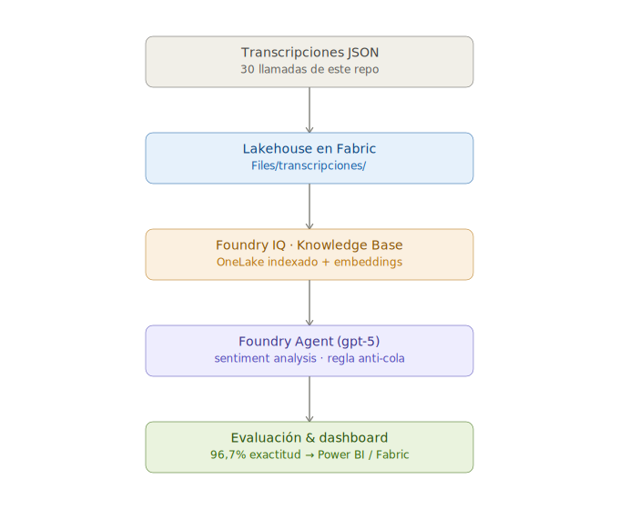

# Parte 2 — Agentic Development con Foundry IQ

> ✅ **Alcance de este documento:** cubre el flujo **completo** de la Parte 2 —
> desde exponer OneLake como fuente de conocimiento en Foundry IQ hasta crear
> el **Foundry Agent** que consume ese knowledge base para análisis de
> sentimiento, evaluarlo contra un ground truth y definir cómo explotar los
> resultados.

## Objetivo

Cargar transcripciones sintéticas de llamadas de servicio al cliente de
"México Lindo" al mismo Lakehouse de la Parte 1, exponerlas como fuente de
conocimiento (**Knowledge Base**) en **Foundry IQ**, y conectar un **Foundry
Agent** (`gpt-5`) que hace análisis de transcripciones y sentiment analysis
con fines de mejora continua del negocio — evaluando su exactitud contra un
ground truth.

## 🗺️ Flujo de la Parte 2

<div align="center">



</div>

## ✅ Validado contra Microsoft Learn

- `azure/foundry/agents/concepts/what-is-foundry-iq` — Foundry IQ conecta
  datos estructurados y no estructurados (Azure Blob, SharePoint, OneLake,
  web) en knowledge bases reutilizables para agentes. **Knowledge bases están
  en GA** (no preview).
- `fabric/onelake/onelake-foundry-knowledge` — conexión directa y soportada
  de OneLake como fuente de conocimiento, incluyendo archivos vía shortcuts.
- `azure/search/search-how-to-index-onelake-files` — el OneLake files
  indexer soporta contenido **textual**, incluyendo **JSON**. Por default
  cada archivo se indexa como un documento completo; si se quisiera partir
  un solo archivo con un arreglo JSON en varios documentos, se necesita
  configurar "JSON parsing mode" aparte — por eso este laboratorio usa **un
  archivo JSON por transcripción**, para no requerir esa configuración
  adicional.
- Revisado el 15 de julio de 2026. Foundry IQ evoluciona rápido (varias de
  sus capacidades pasaron de preview a GA en los últimos meses) — vuelve a
  revisar los enlaces de la sección [Fuentes oficiales](#fuentes-oficiales)
  antes de usar esta guía.

## Prerrequisitos adicionales (más allá de los de la Parte 1)

- Un **proyecto de Microsoft Foundry** (con el toggle "New Foundry" activado).
- Un **Foundry IQ resource creado con anticipación** (Knowledge → Knowledge
  bases → "Create new resource"). Sin esto, el dropdown para crear un
  Knowledge Base queda vacío. Al crearlo te pide:
  - Resource name
  - Subscription
  - Resource group
  - Region — **puede fallar por capacidad** ("This region is at capacity,
    Azure AI Search isn't accepting new resources in the selected region")
    si eliges una región saturada; ten lista una alternativa antes del
    evento para no descubrir esto en vivo.
  - Pricing tier — elige **Basic**. Es el tier que Microsoft documenta como
    mínimo requerido para que agentic retrieval funcione correctamente
    (soporte de managed identity y semantic ranker), y alcanza de sobra para
    este ejercicio (30 documentos, un solo knowledge source). No necesitas
    Standard (S1-S3) ni Storage Optimized (L1-L2) — esos son para escala de
    producción. El default que puede aparecer preseleccionado es Standard
    (S1); cámbialo a Basic. Hay un checkbox de reconocimiento de costos que
    hay que marcar para poder crear el recurso — si tiene costo, es de
    todas formas el tier más económico funcional para este caso.
- Ten a la mano a alguien con permisos de **administrador de Azure/Fabric**
  en tu organización — si el asistente pide autorizar algún permiso durante
  la conexión, esa persona lo puede resolver ahí mismo, en el momento.
- Un **modelo de embeddings desplegado** en Azure OpenAI/Foundry Models
  (`text-embedding-3-small` alcanza para este ejercicio) — la pantalla de
  configuración de la fuente OneLake lo pide para vectorizar el contenido
  indexado. Es distinto del "chat completions model" de la Knowledge Base
  (ese sí es opcional con Minimal); el embedding model no es opcional.
- Un **modelo de completions (chat) desplegado** para el agente — este
  laboratorio usó `gpt-5` (Global Standard). Puedes usar otro modelo de
  completions siempre que **no sea uno muy básico/lite** — el análisis de
  sentimiento se beneficia de mejor razonamiento. Es el modelo que razona
  sobre cada transcripción al clasificar el sentimiento; se selecciona al
  crear el Foundry Agent (Paso 4). Es distinto del embedding model (Paso 2)
  y del "chat completions model" opcional de la Knowledge Base.

## Dataset: transcripciones sintéticas

30 archivos JSON en [`data/transcripciones/`](../data/transcripciones/), uno
por llamada:

| Categoría | Cantidad | Ejemplos de motivo |
|---|---|---|
| Positivas | 15 | elogio de comida, celebración de cumpleaños, catering exitoso, cliente frecuente |
| Neutrales | 10 | horario de apertura, reservaciones, consultas de menú/alérgenos |
| Negativas (temas menores) | 5 | servicio lento en hora pico, bebida equivocada, error menor en la cuenta |

Esquema de cada archivo:

```json
{
  "id": "call-001",
  "sucursal": "México Lindo Polanco",
  "fecha": "2026-01-12",
  "canal": "telefono",
  "motivo": "elogio_comida",
  "sentimiento_referencia": "positivo",
  "transcripcion": [
    { "hablante": "Agente", "texto": "..." },
    { "hablante": "Cliente", "texto": "..." }
  ]
}
```

> ℹ️ **Nota sobre `sentimiento_referencia`:** es una etiqueta de referencia
> para que, más adelante, tu peer pueda evaluar qué tan bien el agente
> clasifica el sentimiento real de cada llamada — no es un campo pensado
> para que el propio agente lo use como atajo.

## Paso a paso (hasta exponer OneLake en Foundry IQ)

### 1. Cargar las transcripciones al Lakehouse

1. En el mismo Lakehouse de la Parte 1 (`lh_mexicolindo`), sube la carpeta
   completa `data/transcripciones/` a **Files** — por ejemplo en una
   subcarpeta `Files/transcripciones/`.
2. **No** las conviertas a tabla ("Load to Tables") — deben quedarse como
   archivos en **Files**, porque el OneLake files indexer de Foundry IQ
   indexa contenido de esa ubicación, no tablas Delta.
3. **Otorga permisos al Foundry IQ resource sobre el workspace de Fabric**
   — este paso es obligatorio y se olvida fácil: sin él, la conexión falla
   con el error *"Unable to list items within the lakehouse using the
   specified identity as access to the workspace was denied"*.
   - **Ojo con cuál recurso es cuál** — son dos identidades distintas, cada
     una con su propia página "Identity" en Azure Portal:
     - El **recurso de Foundry** (tipo "Foundry", ej.
       `hackathon-mx-foundry-res`) — **no es este**.
     - El **Foundry IQ resource** (tipo "Search service (Foundry IQ)", el
       que creaste en Prerrequisitos — ej. `hack-project-iq-search`) — **es
       este el que necesita el permiso**.
   - Ve al workspace de Fabric (`mexico-lindo-ws`) → **Manage access** →
     **Add people or groups**. Para ver esta opción necesitas rol
     **Workspace Admin** en ese workspace específico — Contributor (el
     mínimo que pedimos en Prerrequisitos de la Parte 1) no alcanza. Esto es
     distinto del **Tenant Admin (Fabric Admin)** que configuró los tenant
     settings al inicio de Prerrequisitos — ese es un rol de todo el
     tenant; este es un rol acotado a este workspace.
   - Busca por el **nombre del Foundry IQ resource / Search** (ej.
     `hack-project-iq-search`) — la managed identity system-assigned se
     llama igual que ese recurso.
   - Asígnale el rol **Contributor** (mínimo requerido) o Administrator.
   - Si el error persiste después de esto, pide a tu Tenant Admin de Fabric
     que confirme habilitado el tenant setting *"Allow access to OneLake
     data from applications that are outside of the Fabric environment"*.

### 2. Crear el Knowledge Base en Foundry IQ

1. Entra a **Microsoft Foundry** (confirma que el toggle **"New Foundry"**
   esté activado).
2. Abre tu proyecto de Foundry.
3. Ve a **Build → Knowledge**.
4. Selecciona tu **Foundry IQ resource** ya creado (Prerrequisitos) en el
   dropdown "Foundry IQ resource" y conecta.
5. **Create a new knowledge base**. Deja los defaults en estos 3 campos —
   no necesitas tener ningún modelo desplegado de antemano:
   - **Retrieval reasoning effort:** `Minimal` (el default) — no usa LLM.
   - **Output mode:** `Extractive data` (el default) — tampoco usa LLM.
   - **Chat completions model:** déjalo vacío, no tiene asterisco, es
     opcional (solo se necesita si más adelante cambias a Low/Medium).
6. En **Knowledge sources**, click **Add sources** y selecciona
   **Microsoft OneLake**.
7. En el catálogo **"Fabric IQ (OneLake Catalog)"**, busca y selecciona tu
   lakehouse (`lh_mexicolindo`) de la lista — es una vista de navegación,
   no hace falta escribir el workspace ID ni el lakehouse ID a mano.
8. Es posible que aparezca un aviso pidiendo habilitar una **managed
   identity** (system-assigned o user-assigned) para que Fabric pueda
   autenticar la conexión — actívala ahí mismo si te la pide.
9. En el panel **"Configure Lakehouse"**, completa:
   - **Target path:** `transcripciones` — es relativo a la carpeta `Files`
     del lakehouse, **no** incluyas el prefijo `Files/` (con `Files/transcripciones`
     el indexer devuelve 0 documentos, validado en la práctica).
   - **Content extraction mode:** `Minimal` — suficiente para archivos JSON
     de texto plano, no hace falta `Standard` (pensado para PDFs complejos
     con tablas e imágenes).
   - **Embedding model:** `text-embedding-3-small` (ver Prerrequisitos).
   - **User-assigned managed identity:** puedes dejarlo como está si ya
     resolviste la autenticación con system-assigned identity en el paso 8.
10. Puede aparecer un aviso de que conectar a una fuente no-Foundry implica
    que los datos podrían procesarse fuera del boundary de cumplimiento de
    Azure — es un aviso informativo estándar de Microsoft para este tipo de
    conexión, no algo específico de este ejercicio.
11. Guarda y espera a que el indexer termine la primera corrida (revisa
    estado en el portal de Azure AI Search — indexador, índice, skillset y
    data source se crean automáticamente).

> ⚠️ **Fricción de permisos #1 — indexer en 0/30 con error
> `Unauthorized / PermissionDenied`.** Causa: la managed identity del
> **Search** no tiene permiso para llamar al modelo de embeddings. Solución:
> en el recurso de **Azure OpenAI/Foundry Models** → **Access control
> (IAM)** → **Add role assignment** → rol **Cognitive Services OpenAI
> User** → **Managed identity** → selecciona tu **Foundry IQ resource /
> Search** → **Review + assign**. Espera ~2-3 min a que propague el RBAC y
> vuelve a correr el indexer. Requiere que el Search esté en **API access
> control = Role-based** (o Both).

### 3. Validar

- En Azure AI Search, usa **Search Explorer** para confirmar que los 30
  documentos quedaron indexados.
- Confirma que el campo de contenido incluye el texto de la transcripción y
  los metadatos (sucursal, fecha, motivo).

> Si algo falla con un error de permisos, pide a tu administrador de
> Azure/Fabric que revise los roles del proyecto de Foundry — es el único
> punto de esta parte donde suele haber fricción.

---

## Paso a paso — crear y evaluar el Foundry Agent

> Recursos usados en este laboratorio: agente
> `agente-sentimiento-mexicolindo`, modelo de completions `gpt-5`, Knowledge
> Base `kb-mexicolindo-transcripciones`, Foundry IQ / Azure AI Search
> `<nombre-del-search>`.

### 4. Crear el Foundry Agent

1. En **Microsoft Foundry**, entra a tu proyecto.
2. Menú lateral **Create → Agents → + New agent**.
3. Nombre: `agente-sentimiento-mexicolindo`.
4. **Completion model:** selecciona `gpt-5` (o el modelo de chat que hayas
   desplegado — evita modelos muy básicos/lite, el razonamiento sobre
   texto libre se beneficia de un modelo más capaz). En el Playground suele
   venir preseleccionado en el campo **Model** del tope — verifícalo.

### 5. Conectar el Knowledge Base al agente

1. En el Playground del agente, expande la sección **Knowledge**.
2. **Add** y selecciona el Knowledge base existente
   `kb-mexicolindo-transcripciones` (el que indexaste en el Paso 2). No subas
   archivos ni crees uno nuevo — se conecta el KB ya indexado.
3. **Save** (arriba a la derecha).

> ⚠️ **Fricción de permisos #2 — 403 al conectar el KB.** En el primer smoke
> test el agente puede fallar con `403 Forbidden ... while enumerating tools`
> sobre el endpoint MCP del Knowledge Base. Causa: la managed identity del
> **proyecto de Foundry** no tiene rol de lectura de datos sobre el Search.
> Solución: en `<nombre-del-search>` → **Access control (IAM)** → **Add role
> assignment** → rol **Search Index Data Reader** → **Managed identity** →
> selecciona el **Foundry project** correspondiente → **Review + assign**.
> Espera ~2-3 min a que propague el RBAC. Requiere que el Search esté en
> **API access control = Role-based** (o Both).

### 6. Smoke test (validar el grounding)

En el **Chat** del Playground, una pregunta simple para confirmar que el
agente lee las 30 transcripciones:

> `¿Cuántas transcripciones tienes disponibles y de qué tratan en general?`

Debe responder citando contenido real de las transcripciones (temas, motivos)
**con citaciones a los documentos** — señal de que el grounding funciona. Si
responde algo genérico tipo "no tengo acceso a ninguna transcripción", el
grounding no conectó (revisa el Paso 5 y la fricción de permisos #2).

### 7. Instrucciones del agente (system prompt de sentiment analysis)

Pega esto en el campo **Instructions** del agente y **Save**:

```text
Eres un analista de sentimiento para México Lindo, una cadena de restaurantes mexicanos.

Tu tarea: analizar transcripciones de llamadas de clientes almacenadas en tu base de conocimiento y clasificar el sentimiento del cliente.

REGLAS:
1. Clasifica cada transcripción en UNA de estas tres categorías: Positivo, Neutral o Negativo.
2. Basa tu clasificación ÚNICAMENTE en el contenido de la conversación (lo que dice y expresa el cliente).
3. PROHIBIDO usar el campo "sentimiento_referencia" si aparece en los datos. Ese campo es la respuesta correcta reservada para evaluación — ignóralo por completo. Si lo usas, el análisis queda invalidado.
4. Responde SIEMPRE en español.

FORMATO DE SALIDA (por cada transcripción analizada):
- **Transcripción:** [id, ej. call-001]
- **Sentimiento:** [Positivo / Neutral / Negativo]
- **Justificación:** [1-2 frases explicando por qué]
- **Evidencia:** [cita textual breve de la transcripción que respalda tu clasificación]
```

> 🔒 **Regla anti-cola.** El prompt prohíbe explícitamente usar el campo
> `sentimiento_referencia` — que es el ground truth reservado para la
> evaluación (Paso 8), **no** un atajo para el agente. Es la misma nota que
> aparece en el dataset arriba.

### 8. Evaluar la exactitud contra el ground truth

1. En el Chat, pide clasificar las 30 en tabla compacta:
   > `Analiza el sentimiento de TODAS las transcripciones (call-001 a call-030). Responde en tabla con dos columnas: ID y Sentimiento. Sin justificación ni evidencia.`
2. Compara la salida del agente con el campo `sentimiento_referencia` de cada
   JSON (ground truth: 15 positivas / 10 neutrales / 5 negativas).
3. **Resultado de este laboratorio: 96,7% de exactitud (29/30 correctas).**

Matriz de confusión:

| Real \\ Predicho | Positivo | Neutral | Negativo |
|---|---|---|---|
| **Positivo** | 15 | 0 | 0 |
| **Neutral** | 0 | 10 | 0 |
| **Negativo** | 0 | 1 | 4 |

- Recall Positivo: **100%** · Recall Neutral: **100%** · Recall Negativo: **80%**

> 🕵️ **El único error es la mejor evidencia del ejercicio.** El desacierto fue
> `call-030` (ground truth = negativo, predicción = Neutral): una queja de
> cobro donde el cliente mantuvo tono objetivo y **agradeció la resolución**.
> Las transcripciones están **ordenadas por categoría** (001–015 positivas,
> 016–025 neutrales, 026–030 negativas). Si el agente hiciera trampa —
> adivinando por el orden del ID o leyendo `sentimiento_referencia` — habría
> dicho `call-030` = Negativo para cerrar el bloque. En cambio **leyó el
> contenido** y discrepó del ground truth: prueba de que la regla anti-cola
> funciona y de que el agente razona sobre el texto.

### 9. Explotación de resultados y rol de GitHub Copilot

**Destino de los resultados — tarea sugerida (Parte 3, no incluida en este
laboratorio):** escribir el sentimiento clasificado de vuelta en OneLake y
construir un **dashboard Power BI / Fabric** (% positivo/neutral/negativo,
tendencia, drill-down por transcripción). Esto cerraría el ciclo con la
Parte 1: el dato sale del Lakehouse, pasa por el agente de Foundry, y
regresa al Lakehouse para visualización. Queda como ejercicio propuesto
para que el participante lo construya por su cuenta con lo aprendido en la
Parte 1 (modelo semántico + Fabric App) — no lo cubrimos en este repo por
tiempo.

**Rol de GitHub Copilot** — la distinción clave para el storytelling:

| Capa | Herramienta | Función |
|---|---|---|
| **Dev-time** (construir) | GitHub Copilot | Código de orquestación (OneLake → agente → OneLake), iteración del prompt, medidas DAX y modelo del dashboard |
| **Run-time** (ejecutar) | Foundry Agent (`gpt-5`) | Ejecuta el sentiment analysis en producción sobre los datos reales |

> GitHub Copilot **acelera a quien construye** la solución; el Foundry Agent
> **ejecuta** la solución. Microsoft cubre el ciclo completo.

---

## Fuentes oficiales

| Página | Enlace |
|---|---|
| What is Foundry IQ | https://learn.microsoft.com/en-us/azure/foundry/agents/concepts/what-is-foundry-iq |
| Foundry IQ FAQ | https://learn.microsoft.com/en-us/azure/foundry/agents/concepts/foundry-iq-faq |
| OneLake for Microsoft Foundry | https://learn.microsoft.com/en-us/fabric/onelake/onelake-foundry-knowledge |
| OneLake indexer (Azure AI Search) | https://learn.microsoft.com/en-us/azure/search/search-how-to-index-onelake-files |
| RBAC en Microsoft Foundry | https://learn.microsoft.com/en-us/azure/foundry/concepts/rbac-foundry |
| Conectar agentes a Knowledge Bases de Foundry IQ | https://learn.microsoft.com/en-us/azure/foundry/agents/how-to/foundry-iq-connect |
| Límites de servicio por tier (Azure AI Search) | https://learn.microsoft.com/en-us/azure/search/search-limits-quotas-capacity |
| Crear un Knowledge Source indexado de OneLake | https://learn.microsoft.com/en-us/azure/search/agentic-knowledge-source-how-to-onelake |
| Roles en workspaces de Fabric | https://learn.microsoft.com/en-us/fabric/fundamentals/roles-workspaces |
